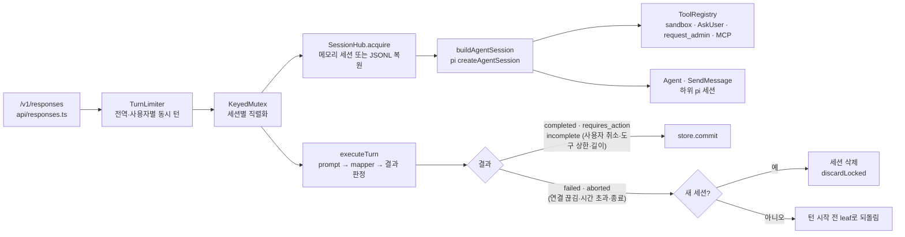

# agent harness: 턴 하나의 흐름

```mermaid
flowchart LR
  R["/v1/responses<br/>api/responses.ts"] --> L["TurnLimiter<br/>전역·사용자별 동시 턴"]
  L --> K["KeyedMutex<br/>세션별 직렬화"]
  K --> H["SessionHub.acquire<br/>메모리 세션 또는 JSONL 복원"]
  H --> F["buildAgentSession<br/>pi createAgentSession"]
  F --> T["ToolRegistry<br/>sandbox · AskUser · request_admin · MCP"]
  F --> S["Agent · SendMessage<br/>하위 pi 세션"]
  K --> E["executeTurn<br/>prompt → mapper → 결과 판정"]
  E --> C{"결과"}
  C -->|"completed · requires_action<br/>incomplete (사용자 취소·도구 상한·길이)"| CM["store.commit"]
  C -->|"failed · aborted<br/>(연결 끊김·시간 초과·종료)"| N{"새 세션?"}
  N -->|"예"| D["세션 삭제<br/>discardLocked"]
  N -->|"아니오"| RW["턴 시작 전 leaf로 되돌림"]
```
